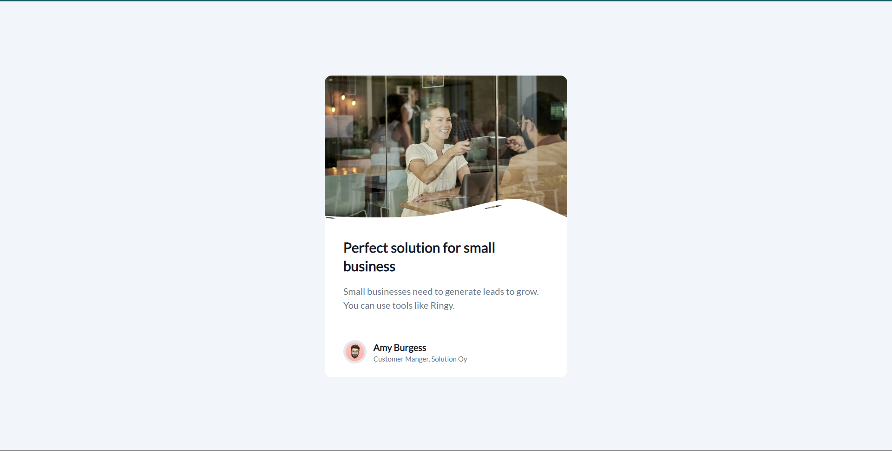

# Business-Blog-Card - #devChallenges

This project is a minimalist card component for displaying blog or article information. It utilizes technologies such as React and Tailwind CSS to create a clean and elegant user interface.

## Technologies Used
- HTML
- CSS
- JavaScript
- React.js
- Tailwind CSS

## Demo

You can see a demonstration of the application in action [Business-Blog-Card](https://ibrahim-003.github.io/business-blog-card/).

## Capturas de Pantalla

